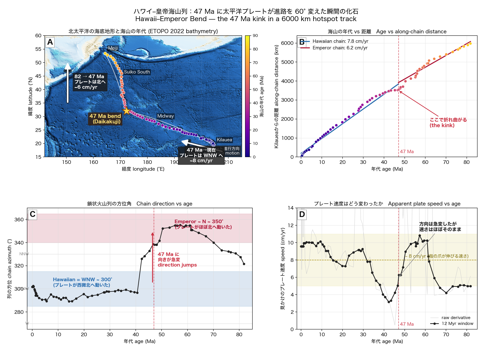

# hawaii-emperor

Hawaii–Emperor seamount chain の年代分布から、**太平洋プレートが 47 Ma に
NNW → WNW へ 60° 方向転換した** 瞬間を 1 枚の図で示す。

速度は変わっていない。変わったのは向きだけ。その化石が海底に 60 個以上の
火山として直列に刻まれている。



## データソース

- O'Connor et al. 2013, *G³* 14, 4564 — Hawaii–Emperor Ar-Ar age compilation
- Sharp & Clague 2006, *Science* 313, 1281 — Emperor seamount redate
- Kilauea を距離原点 (19.42°N, 204.71°E) とする大円距離

## 使い方

```bash
python -m pip install -e .[dev]
pytest
python scripts/generate_hawaii_emperor_figure.py
```

出力: `outputs/hawaii_emperor_bend.png`
